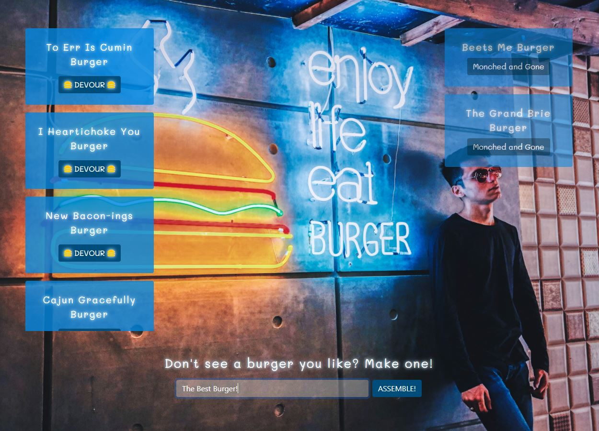

# Eat-A-Burger

## Table of Contents
* [ Deployed Site ](#Deployed-Site)
* [ Description ](#Description)
* [ Installation ](#Installation)
* [Contributors](#Contributors)
* [ License ](#License)
* [ Contact Me ](#Contact)

## Deployed Site
* https://rocky-refuge-24685.herokuapp.com/

## Description
* EAT A BURGER! Allows the user to devour burgers, see burgers that have already been eaten, and create new burgers to eat!

## Installation
* Clone down the repo
* Install npm packages by opening your terminal inside of the application repo and typing 'npm i'
* Use schema and seed sql files to create and populate database.
* Open on you local machine by going to localhost:3000!

## Contributors
* [Pexels - User Seyed Ali](https://www.pexels.com/photo/man-leaning-on-a-wall-with-signage-2331536/)
* [Bootstrap](https://getbootstrap.com/)
* [Font Awesome](https://fontawesome.com/)

## License
* This project is [MIT](https://choosealicense.com/licenses/mit/) licensed

## Questions? Contact Me! 
* Github: https://github.com/dianalynshull
* Email: dianalynshull@gmail.com
* Preferred Contact: Email
